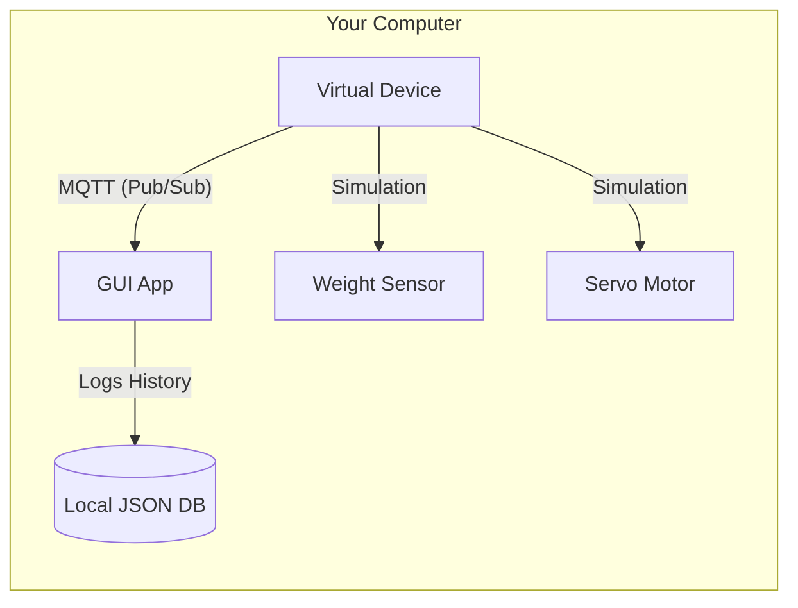

# 💻 Simulator Mode Setup Guide

Welcome to the **Smart Pet Feeder Simulator!** This guide will help you get the entire system running on your computer in minutes, without needing any physical hardware.

---

## 🌟 Why use the Simulator?

> [!TIP]
> **Perfect for:** Testing UI changes, debugging logic, or demonstrating the project when physical hardware isn't available.

- **Fast Iteration:** See changes immediately without uploading firmware.
- **Safety First:** No risk of overflowing real pet food!
- **Zero Cost:** Test all features for free using your computer's resources.

---

## 🛠️ Prerequisites

Before we begin, ensure you have:
- [ ] **Python 3.8+** installed ([Download here](https://www.python.org/))
- [ ] **pip** (usually comes with Python)
- [ ] A terminal or command prompt (CMD/PowerShell)

---

## ⚡ Quick Start (The Easiest Way)

We've provided a **`manage.bat`** script to automate everything for Windows users.

1.  **Open the project folder** in File Explorer.
2.  **Double-click `manage.bat`**.
3.  **Select Option 1 (Setup)**: This installs all required libraries automatically.
4.  **Select Option 2 (Run Simulator)**:
    - This will automatically create your `.env` configuration.
    - It will launch the **Virtual ESP32** in a new terminal.
    - it will launch the **Main GUI Application**.

---

## 🕹️ Manual Setup (Step-by-Step)

If you prefer to run things manually or are on a non-Windows system:

### 1. Install Dependencies
```bash
pip install -r requirements.txt
```

### 2. Configure Environment
```bash
# Copy the example config
copy .env.example .env
```
Ensure `MODE=SIMULATOR` is set in your new `.env` file.

### 3. Start the Components
You need to run these in **two separate terminals**:

| Task | Command | Description |
| :--- | :--- | :--- |
| **Terminal 1** | `python simulator/virtual_device.py` | This is your "Virtual ESP32" |
| **Terminal 2** | `python main.py` | This is the User Interface |

---

## 📊 What's Happening Under the Hood?

The simulator mimics real-world physics and IoT communication:



- **Weight Simulation**: The "pet" will randomly eat food, causing the weight to drop.
- **Auto-Stop**: When you trigger a feed, the motor closes automatically when the bowl reaches 90g.
- **Persistence**: Your feeding history is saved to `simulator/data/feeding_history.json`.

---

## 🔍 Troubleshooting

> [!IMPORTANT]
> **"Virtual device not connecting?"**
> Ensure no other process is blocking the MQTT port (8883/1883) if you changed the defaults.

> [!WARNING]
> **"Blank Graphs?"**
> The simulator generates mock data for the current month. If you don't see data, ensure your system clock is correct or try selecting today's month in the UI dropdown.

---

## 🚀 Next Steps

Ready for the real deal? Once you've mastered the simulator, check out the [**Real Hardware Setup Guide**](setup_real.md) to start building your physical feeder!

---
**Happy Testing! 🐶🐱**
