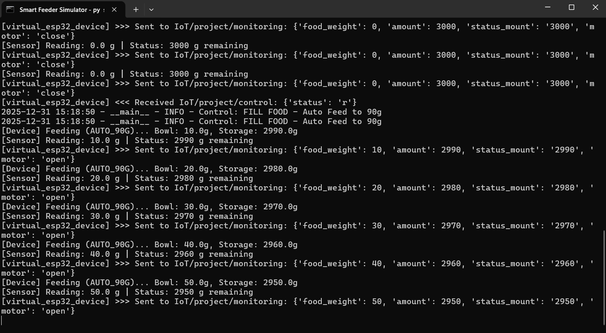

# 🎮 Smart Pet Feeder Simulator

This simulator allows you to test the Smart Pet Feeder application without any physical hardware. It mimics a real ESP32 device, a load cell sensor, and a servo motor.

---

## 🚀 Quick Start (Play Time!)

Ready to see it in action? Follow these simple steps:

1.  **Open the Manager**: Run `manage.bat` in the project root.
2.  **Start Simulator**: Select **Option 2** ("Run Application (Simulator Mode)").
3.  **Watch the magic**: Two windows will appear:
    - **Simulator Terminal**: Shows real-time sensor readings and motor actions.
    - **Application GUI**: The main control panel for your pet feeder.

---

## 📸 Visual Guide

| Virtual Device (Terminal) | Application GUI |
| :---: | :---: |
|  |  |
| *Real-time sensor logs* | *User control interface* |

---

## 🛠️ How It Works

The simulator is built with two main "Virtual" components:

### 1. Virtual "Load Cell" (Weight Sensor)
- **Behavior**: Reports the weight of food in the bowl.
- **Logic**: 
    - When feeding, the weight increases.
    - When the motor is closed, the weight slowly decreases (simulating a pet eating!).
- **Logs**: Look for `[Sensor] Reading: XX.X g` in the terminal.

### 2. Virtual "Servo Motor"
- **Behavior**: Controls the flow of food.
- **Logic**:
    - **Manual Feed**: Opens the motor until you click STOP.
    - **Fill Food (Auto)**: Automatically feeds until the bowl reaches **90g**, then stops.
- **Logs**: Look for `[Device] Feeding...` or `Motor: OPEN/STOP`.

---

## 💬 Communication (IPC)

The Simulator and the App "talk" to each other using a local file named `mqtt_bus.jsonl`. 
- **App sends command** -> Written to file -> **Simulator reads & executes**.
- **Simulator sends data** -> Written to file -> **App reads & updates UI**.

This mimics how real hardware uses a Cloud MQTT broker, but runs entirely on your computer!

---

## 💡 Next Steps
- Try clicking **"FILL FOOD"** and watch the weight climb to exactly 90g in the terminal.
- Wait a few seconds to see the weight slowly decrease as the "virtual pet" snacks!
